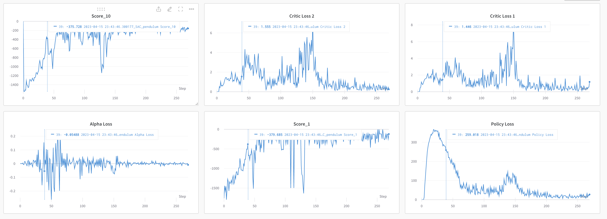

# Soft Actor Critic

This repository is the Pytorch implementation of [Soft Actor Critic](https://arxiv.org/abs/1801.01290)
This implemetation is based on the algorithm version2 which removes Value Approximator. 

---

## Pseudocode of the SAC algorithm


---

## Set up

Install dependencies with Docker. You can also install dependencies using requirements.txt.

To build Docker image, run this command.
```
# format: docker build -t . <image_name>
docker build -t . sac
```

After building image, use the following command to run the Docker container.
```
docker run -ti --gpus '"device='<gpu number>'"' -v <your working directory>:/app --ipc=host --name <container_name> <image_name> /bin/bash

# or you can run this command after changing docker_run.sh file in proper format
./docker_run.sh <gpu num> <container_name>
```
---

## Train
If you want to train your own agent with SAC algorithm in Pendulum-v1 or LunarLanderContinuous-v2 environment, run this command inside the Docker container.
```
# For Pendulum-v1
python train_.py --config config_pendulum.yaml

# For LunarLanderContinuous-v2
python train_.py --config config_lunarlander.yaml
```

You can freely change the hyperparameter if you needed.

---
## Test

You can test with the pretrained networks.
It can be downloaded in following links.

[Pendulum_v1](https://drive.google.com/file/d/1rc9KF1G0cVeGfKsK8y8NGGHjmFtfEUWN/view?usp=share_link)

[LunarLanderContinuous-v2](https://drive.google.com/file/d/1migtiJc9Eu8iAueeYY3MGOr825Y3mcoa/view?usp=share_link)

To render the playing result with the network, run
```
# before run this command, you should put the path to checkpoint in config file.
# For Pendulum-v1
python render.py --config config_pendulum.yaml

# For LunarLanderContinuous-v2
python render.py --config config_lunarlander.yaml
```

---
## Results

The rendered result of playing Pendulum-v1.


The rendered result of playing LunarLanderContinuous-v2.


The training logs of SAC algorithm for Pendulum-v1.



The training logs of SAC algorithm for LunarLanderContinuous-v2.


---
## Acknowlegement
1. https://github.com/seungeunrho/minimalRL/blob/master/sac.py
